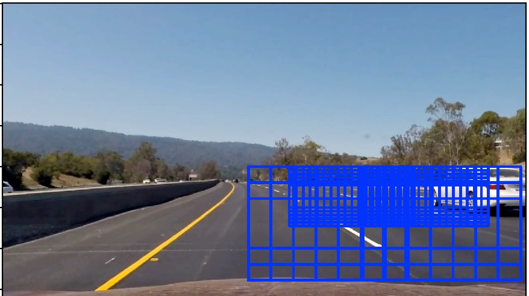
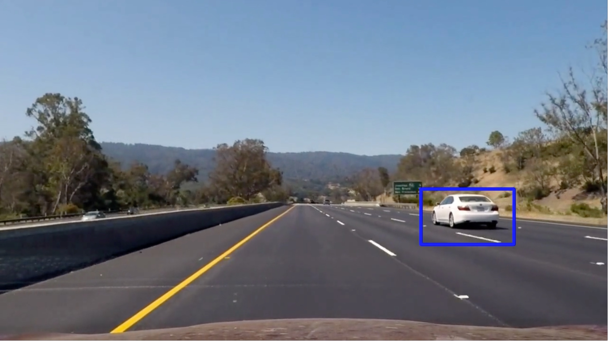
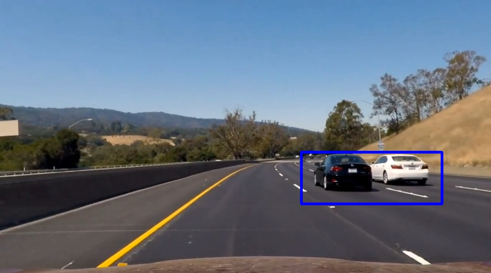
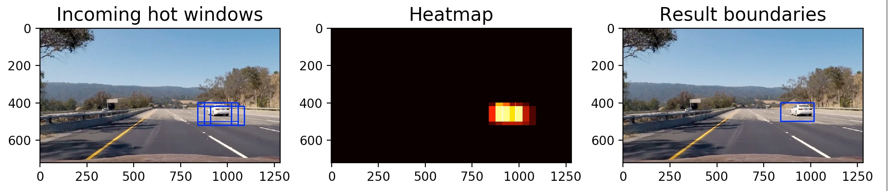
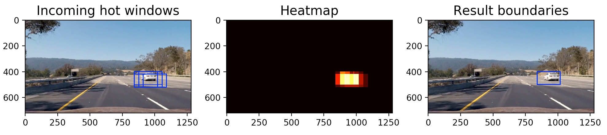
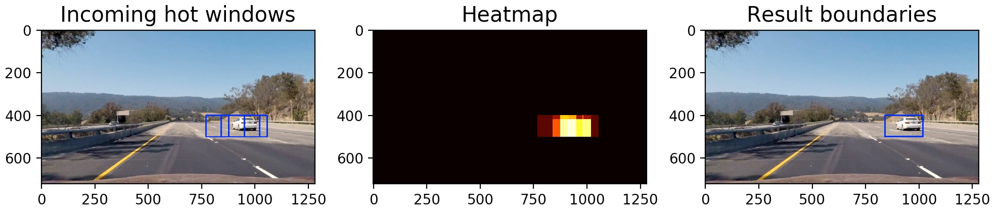
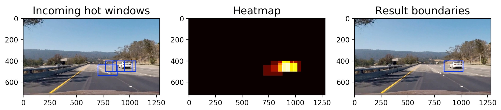
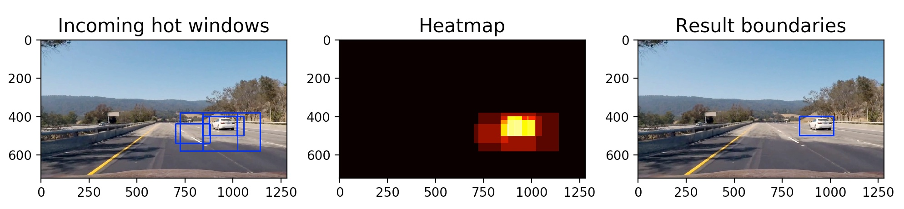

## Project 5 - Vehicle Detection

The goals / steps of this project are the following:

* Perform a Histogram of Oriented Gradients (HOG) feature extraction on a labeled training set of images and train a classifier Linear SVM classifier
* Implement a sliding-window technique and use trained classifier to search for vehicles in images.
* Run pipeline on a video stream and create a heat map of recurring detections frame by frame to reject outliers and follow detected vehicles.
* Estimate a bounding box for vehicles detected.

 
 

[//]: # (Image References)
[image1]: ./project%20example%20repo/examples/car_not_car.png
[image2]: ./project%20example%20repo/examples/HOG_example.jpg
[image3]: ./project%20example%20repo/examples/sliding_windows.jpg
[image4]: ./project%20example%20repo/examples/sliding_window.jpg
[image5]: ./project%20example%20repo/examples/bboxes_and_heat.png
[image6]: ./project%20example%20repo/examples/labels_map.png
[image7]: ./project%20example%20repo/examples/output_bboxes.png

## [Rubric](https://review.udacity.com/#!/rubrics/513/view) Points

###Histogram of Oriented Gradients (HOG)

####1. Explain how (and identify where in your code) you extracted HOG features from the training images.

I have a single function that extracts features from images at various points in my workflow. That code lives in the `lesson_functions.py` module. See line 149 `get_hog_features()`.

My process of training the classifier is shown in `train_classifier.train()`. I start by building separate lists of image paths for cars and non-cars. Then I shuffle the lists, because I end up taking a sub-sample of the lists. I didn't want the images to be in order as looking through them, many of the images are the same car taken from successive frames of a video stream.

I then extract the features for cars and non-cars separately. I modified the code in `lesson_functions.extract_features()` (line 65) to use multi-core processing to speed things up. I ended up not needing this but it helped during testing when I was using the full data sets to get about a 10X speed increase in extracting the features from thousands of images.

Here is a picture showing examples of the difference between car and non-cars. 

Here are some images showing the hog features visualizations from the Y, Cr, and Cb channels from a typical car image.

 

I then explored different color spaces and different hog parameters (`orientations`, `pixels_per_cell`, `cells_per_block`, `color_space`, and `hog_channel`). I setup my `train()` function to also call my video pipeline (discussed below) on a sub-section of the project video to get quick visual feedback how the cars were found with various combinations.

####2. Explain how you settled on your final choice of HOG parameters.

I tried various combinations of parameters but found that staying with the given values for `orient`, `pix_per_cell`, and `cell_per_block` resulted in the best performance of finding the cars. I did have to change the `color_space` though, as the default of `RGB` resulted in terrible performance for me--false positives all over the screen and very inconsistent performance on the cars.

I tried every color space option and ended up finding that the `YCrCb` color space gave best results overall. Actually, `HLS` was the best in the full sunlight portions of the video, but it does poorly in the frames where the cars are in shadows. `YCrCb` was not as great in full sunlight, but was more consistent in shadows. So when I added frame averaging and heat-mapping, `YCrCb` ended up being the best choice for consistent performance.

####3. Describe how (and identify where in your code) you trained a classifier using your selected HOG features.

I ended up not using the histogram or raw color features as they did not help car identification. See `train_classifier.py` lines 71-94 for the training pipeline.

I first stack all of the features, then calculate a scaler that determines the mean and deviation from 0 across all of the features. Then I scale all of the features using the scaler. Then I create labels for the cars and non-cars (`1` and `0` respectively). Then I split the data into train and test sets. Finally I create a `LinearSVC()` object, train it with the test data, and check how it fared against the test data.

The output of this function is a pickled dictionary which contains the exact parameters used in feature extraction. It is important to use these same settings for later feature extraction so the feature vectors will be the same length and performing predictions against the `LinearSVC()` object will work correctly.

 
 

###Sliding Window Search

####1. Describe how (and identify where in your code) you implemented a sliding window search.

For this project I decided to program the window searching to the video. I did this for the sake of time, as searching many windows takes a long time to run. See the module `search_classify.py` lines 75-110. 

I start by dismissing the top half of the image as there won't be any cars up there (yet, flying cars are coming!) Then I also dismiss the left part of the frame as this video file contains a car driving in the left lane. Obviously a real-time detector would not make these assumptions, but it would also be written in a language which would run faster than python, and thus could search the frame more thoroughly!

Here is an image showing the window search regions. I search a smaller region with smaller windows and more overlap to match cars that are further away, as they will be smaller in size at distance and their movement is relatively less, so the boxes must be closer together to track them sufficiently.

####2. Show some examples of test images to demonstrate how your pipeline is working.  What did you do to optimize the performance of your classifier?

Ultimately I searched on two scales using YCrCb 3-channel HOG features. Using time-averaging and heat-mapping I was able to get a smooth result and also reduce spurious noise (false-positives) that only show up in single frames. Here are some example images:

---

### Video Implementation

####1. Provide a link to your final video output.  Your pipeline should perform reasonably well on the entire project video (somewhat wobbly or unstable bounding boxes are ok as long as you are identifying the vehicles most of the time with minimal false positives.)
Here is a [link to my video result](./output_images/pipeline_output.mp4)

####2. Describe how (and identify where in your code) you implemented some kind of filter for false positives and some method for combining overlapping bounding boxes.

I accomplished time averaging by holding the `heat` matrix in memory between iterations to `detect_multiple.do_it()` (line 81). For each call to the function, I added some 'heat' for each incoming detected box. Then I thresholded such that only recently highly detected boxes made the cut, and all other pixels of the heatmap were set to 0.

To mark the boundary boxes I used `scipy.ndimage.measurements.label()` to identify individual blobs in the heatmap.  I then assumed each blob corresponded to a vehicle.  I constructed bounding boxes to cover the area of each blob detected. Finally, I applied some decay to the heatmap by multiplying the whole thing by `0.6`. 

This decay factor ensures that the contribution from pixels where the car is no longer located die go to zero over time.

I used a threshold of 4 so there must be 4 overlapping boundary boxes for a given region to be ultimately marked as a match and have a boundary box applied to the output. 

Here's an example result showing the heatmap from a series of frames of video. The left image shows the raw incoming 'hot' windows. The middle image shows the aggregated heatmap. And the right image shows the resulting labeled boundary. Note how even in regions where there are some spurious incoming windows, the heatmap does a good job at thresholding those windows out of the final boundary.

 
 

---

###Discussion

####1. Briefly discuss any problems / issues you faced in your implementation of this project.  Where will your pipeline likely fail?  What could you do to make it more robust?

My biggest problem was in tuning my pipeline to run reasonably fast enough while still searching over enough windows to get good signal-to-noise for positive window activation. If I search over a very fine grid, then I get lots of positive results which make for a very distinct heatmap and good boundary results. But this comes at the tradeoff of speed. When the calculations are very slow, it is extremely difficult to tune the averaging pipeline. 

To get around this, I had to limit the search window to where I knew cars would be in the sample video. Obviously this pipeline would fail even if the car simply moved to the center lane! (or any other lane than the furthest left, for that matter)

I experimented with using multi-core processing to get faster calculation times, but I think there is a marginal gain from that because the individual calls to the main pipeline method `search_classify.do_it()` are fairly fast in themselves, so splitting the sub-calculations across cores creates more overhead than anything else. The real solution would be to multi-core process the individual frames of the video, but unfortunately I was not able to figure out how to do this within the context of the `moviepy` library we were shown to use for video processing. I maxed out at 4 FPS with a maxed-out 2015 MacbookPro. My CPU usage was about 40% the whole time. So if only I could find a way to effectively use all of the cores on my machine, I think I could get somewhere close to 10-15 FPS. I think this would pass as 'real-time' for an actual car's use, as I surely don't make more than 15 adjustments to my real-world driving per second!

Simply put, to make my pipeline more robust, I would add more search windows on the left side of the image to detect cars all around, and I would also add more windows on a finer grid than I am currently using in order to better detect fine car movement.